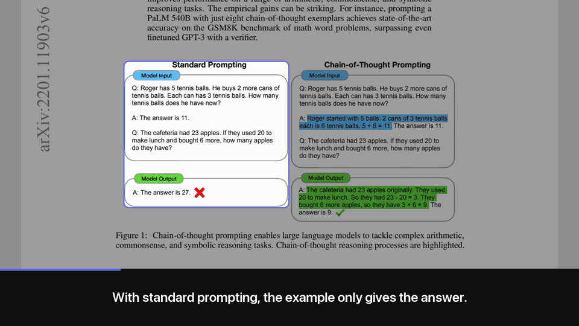

# talkthrough

[](https://github.com/amishah1998/talkthrough/actions/workflows/smoke.yml)

**A walkthrough that talks. Any HTML page or PDF becomes a narrated video of itself.**

A camera moves over the real page one section at a time, a spotlight shows what is being explained,
a voice explains it, and captions follow the voice. Nothing on screen is redrawn or restyled: every
frame is a real crop of your page, so the diagram in the video is the diagram in the document.



*The Chain-of-Thought Prompting paper ([Wei et al. 2022](https://arxiv.org/abs/2201.11903), CC BY 4.0).
The full 58-second walkthrough, with sound and the free local voice:*

https://github.com/user-attachments/assets/bbc0805c-d711-4213-aeb9-a08ec82a8158

The narration is written by Claude from the page's own text, under one rule: add nothing the page
does not say. That keeps the numbers right far more often than a fresh script would, but it is a model
writing text, not a guarantee. Read the shot list or the preview sheet before you share a video about
numbers that matter.

Use it for the report nobody will open, the recap your students watch on the bus, or the docs page
you want to post as a 90-second clip.

## Quickstart

### In Claude Code (recommended)

```
/plugin marketplace add amishah1998/talkthrough
/plugin install talkthrough@talkthrough
```

Then ask: "make a walkthrough video of report.pdf". Claude reads the page, decides what to focus on,
writes the shot list, checks the framing on a preview sheet, and renders with the free local voice.
No API key needed; the agent does the planning.

The skill in `skills/talkthrough/` follows the Agent Skills format, so other agents that read
skills can use the same folder.

### From the command line

You write the shot list, the tool does the rest. No API key, and this is the path the test suite runs
on Linux:

```bash
pip install "talkthrough[local] @ git+https://github.com/amishah1998/talkthrough"
talkthrough doctor                                  # checks browser, ffmpeg and a voice
talkthrough capture report.pdf --out work/          # page image and a numbered list of sections
# write work/shots.json (format below), then:
talkthrough preview work/ && talkthrough render work/ --out report.mp4 --open
```

The `plan` and `make` commands are untested as of this release; the capture, hand-written
shots.json, preview and render path is verified. `talkthrough make report.pdf` does it all in one go,
with Claude choosing the sections through the API, and needs `ANTHROPIC_API_KEY` plus
`pip install "talkthrough[all] @ git+https://github.com/amishah1998/talkthrough"`.

## How it works

```
page.html / report.pdf
   │  capture   headless browser (HTML) or pdfium (PDF): one tall image + a list of sections
   ▼
page.png + boxes.json
   │  plan      an agent or Claude picks the sections that matter and writes what to say
   ▼
shots.json
   │  preview   one spotlighted frame per shot, to check framing before rendering
   │  render    voice per shot, eased camera moves, spotlight, captions, H.264 + AAC
   ▼
walkthrough.mp4   (portrait 1080x1920 by default; landscape and square too)
```

Step by step, with a shot list you write or edit yourself:

```bash
talkthrough capture recap.html --out work/
talkthrough plan work/ --seconds 90 --note "focus on the pricing table"   # or write work/shots.json by hand
talkthrough preview work/
talkthrough render work/ --out recap.mp4
```

A shot list looks like this:

```json
{
  "format": "portrait",
  "tts": "auto",
  "shots": [
    {"boxes": ["b0"], "say": "Here is the whole report in ninety seconds. Three findings, one decision."},
    {"rect": [95, 828, 470, 440], "move": "hold", "say": "This chart is the one to remember: costs fell while usage doubled."}
  ]
}
```

### Title card, end card, file size

Every video opens on a short title card (the page title and the running time) and closes on an end
card: "Read the full page", the page's link, and a small "made with talkthrough" line. In the
shot list, `"title"` and `"link"` override what is shown (set `"link"` to the public URL when you
render a local file), and `"intro": false`, `"outro": false` or `"credit": false` turn parts off.

`--speed 1.25` (or `"speed": 1.25`) makes the voice itself talk faster, with natural pitch; the camera
and captions follow because they are timed from the audio. Useful for readers who would otherwise
watch at 1.5x.

`render --share` (or `"quality": "share"`) encodes for chat apps at about half the size of the
default, with no visible loss on text. Audio is loudness-normalised in both modes, so every voice
comes out at the same level.

## Voices

It picks the first one available, in this order, or you choose with `"tts"` in the shot list or `--tts`:

| Voice | Setup | Captions | Cost | Notes |
|---|---|---|---|---|
| **Cartesia Sonic 3.6** | `CARTESIA_API_KEY` | exact word timings | about $0.25 per 1,000 words | #1 on the [Artificial Analysis TTS leaderboard](https://artificialanalysis.ai/text-to-speech/leaderboard) when this was written |
| **ElevenLabs** | `ELEVENLABS_API_KEY` | exact word timings | about $0.30 to $0.60 per 1,000 words | Large voice library |
| **OpenAI gpt-4o-mini-tts** | `OPENAI_API_KEY` | per sentence | cents per video | Tone and pace steerable with `"instructions"` |
| **Kokoro** (local, free) | `pip install "talkthrough[local] @ git+https://github.com/amishah1998/talkthrough"` | per sentence | free | Apache-2.0 weights, runs on CPU on macOS, Linux and Windows; one-time ~350 MB download |
| **macOS `say`** | nothing | per sentence | free | Zero setup on a Mac; clearly synthetic |

"Per sentence" means each sentence is voiced on its own and measured, so captions change exactly on
sentence boundaries; words inside a sentence are spread by length.

## Requirements

| For | Needs | Notes |
|---|---|---|
| Everything | Python 3.10+ and ffmpeg | Pillow, websockets and pypdfium2 install with the package |
| HTML pages | Chrome, Chromium or Edge | Found automatically; or set `CHROME=/path/to/browser` |
| PDFs | nothing extra | Rendered with pdfium; sections come from the page's white space, not its text layer |
| A voice | one of the options above | `talkthrough doctor` shows what it found |
| Auto-planning | `anthropic` and `ANTHROPIC_API_KEY` | Not needed when an agent writes the shot list |

## Limits

- Tested on macOS by hand and on Ubuntu (Python 3.10 and 3.12) by the smoke test on every push:
  an HTML page and a PDF rendered with the Kokoro voice. Windows support is written but untested.
- The Cartesia, ElevenLabs and OpenAI voices and the `plan` and `make` commands have not been run
  end to end yet. The local Kokoro voice has.
- Section detection splits on white space, so a figure with tightly packed panels can come out as
  one section. Frame part of it with a `rect`; the outline snaps to the content you meant.
- Pages behind a login or that build slowly can capture half-loaded. Capture a saved copy or a PDF.
- Narration works best in English or Hinglish in Roman letters. Pages in any language capture fine,
  and Hindi in a caption gets a Devanagari font, but the voices are tuned for English and correctly
  joined Hindi letters need libraqm installed.

## Licence

[MIT](LICENSE)
